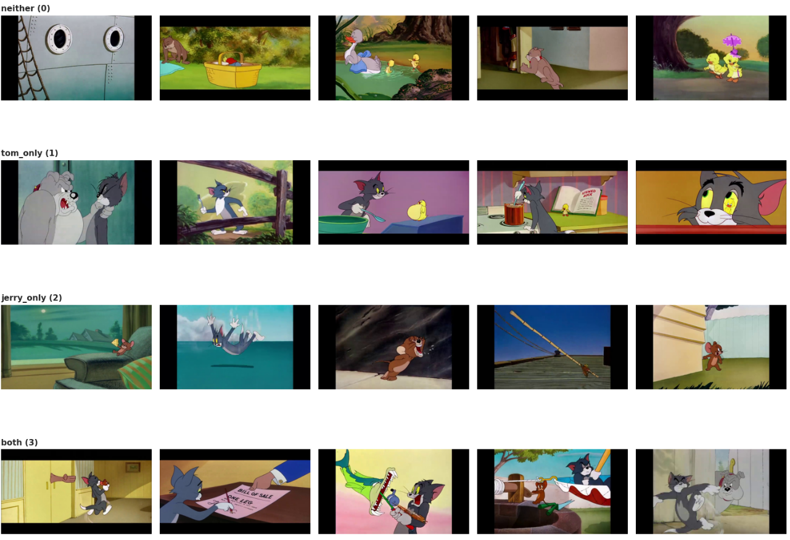
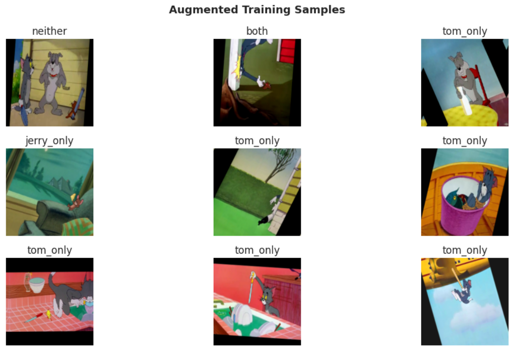
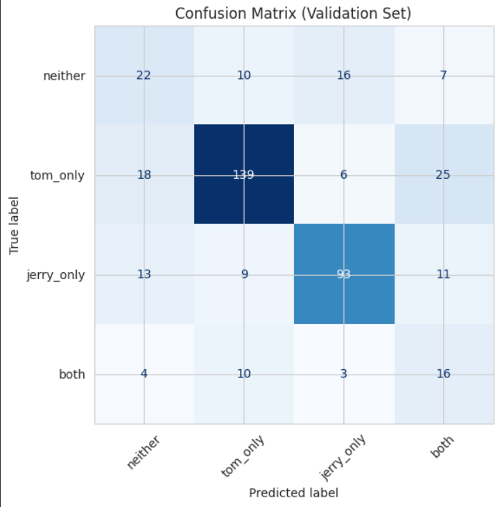
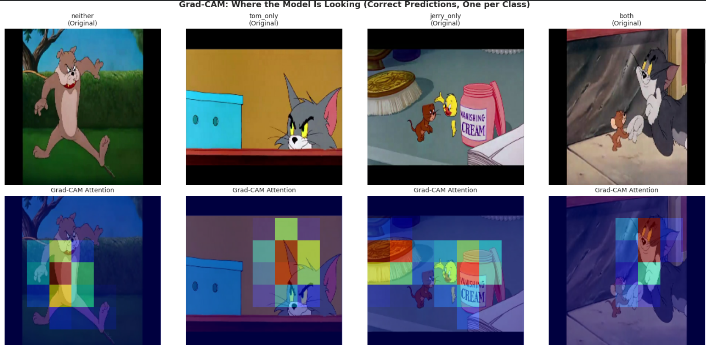
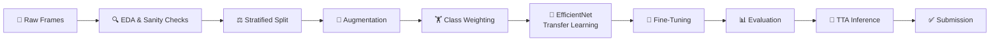

<div align="center">

<!-- 🖼️ Add a banner image here — e.g. a strip of Tom & Jerry frames or your Grad-CAM visualization -->

# 🐱 Tom & Jerry Image Classification 🐭


### Detecting Cartoon Characters in Frames with Deep Learning

*A multi class computer vision model built for the OctWave 3.0 - Kaggle Challenge 02*

<br>


<br>

**[🚀 View Notebook](#) · [📊 Results](#-results) · [🖼️ Gallery](#️-gallery) · [🛠️ Setup](#️-installation--usage)**

</div>

---

## 📖 Overview

> *"Character recognition in video frames is a fundamental challenge in computer vision."*

This project tackles a **4-class image classification problem**: given a frame extracted from the classic *Tom & Jerry* cartoon series, predict which character(s) appear in it.

| Class | Meaning |
|:---:|:---|
| 🚫 `0` | Neither character present |
| 🐱 `1` | Only **Tom** |
| 🐭 `2` | Only **Jerry** |
| 🐱🐭 `3` | **Both** Tom and Jerry |

Built end-to-end with **transfer learning**, careful **class-imbalance handling**, and full **model interpretability** — not just a black box that spits out a number.

<br>

## 🎯 The Challenge

<div align="center">

| 📦 Dataset | 🎯 Metric | ⚖️ Difficulty |
|:---:|:---:|:---:|
| 5,481 real cartoon frames | Macro F1-score | Severe class imbalance + visual noise |

</div>

The dataset is explicitly **imbalanced** and **noisy** — motion blur, partial occlusion, and characters sharing screen space with each other and background elements. This isn't a clean, curated dataset — it's messy, real, extracted-from-video data.

```
📊 Class Distribution (Training Set)
━━━━━━━━━━━━━━━━━━━━━━━━━━━━━━━━━━━━━━━━━━━━━━━━━━━━━
🐱 Tom only    ████████████████████████░░░░░░░░  46.7%  (1,252)
🐭 Jerry only  ████████████████░░░░░░░░░░░░░░░░  31.4%  (841)
🚫 Neither     ███████░░░░░░░░░░░░░░░░░░░░░░░░░  13.7%  (368)
🐱🐭 Both      ████░░░░░░░░░░░░░░░░░░░░░░░░░░░░░   8.2%  (219)
━━━━━━━━━━━━━━━━━━━━━━━━━━━━━━━━━━━━━━━━━━━━━━━━━━━━━
```

<br>

## 🖼️ Gallery

<!-- 🖼️ Add your actual screenshots here — replace the paths below with your real image files -->

<table>
<tr>
<td width="50%">

**Sample Training Frames**


</td>
<td width="50%">

**Augmented Training Data**


</td>
</tr>
<tr>
<td width="50%">

**Confusion Matrix**


</td>
<td width="50%">

**Grad-CAM: Where the Model Looks**


</td>
</tr>
</table>

<br>

## 🧠 Approach



<details>
<summary><b>🔬 Click to expand full methodology</b></summary>

<br>

1. **Exploratory Data Analysis** — class distribution, sample inspection, corrupt-file scanning, image size consistency checks
2. **Stratified Train/Validation Split** — preserves each class's proportion, critical given the imbalance
3. **CSV-Driven Data Pipeline** — images loaded by filename via `tf.data`, not folder structure
4. **Data Augmentation** — random flip, rotation, zoom, contrast, brightness jitter (training-only)
5. **Class Imbalance Handling** — balanced class weights + oversampling of underrepresented classes
6. **Transfer Learning** — pretrained EfficientNet backbone (ImageNet weights)
7. **Two-Stage Training**
   - 🥶 **Stage A** — backbone frozen, train new classification head
   - 🔥 **Stage B** — fine-tune with a much lower learning rate
8. **Evaluation** — Macro F1, per-class precision/recall/F1, confusion matrix, misclassified examples
9. **Grad-CAM** — visual sanity check that the model attends to the actual characters
10. **Test-Time Augmentation (TTA)** — predictions averaged across multiple augmented passes for robustness

</details>

<br>

## 🏗️ Model Architecture

<div align="center">

```
┌─────────────────────────────────────────────┐
│              Input Image (RGB)               │
└────────────────────┬──────────────────────────┘
                      ▼
┌─────────────────────────────────────────────┐
│         EfficientNet (ImageNet pretrained)    │
│              [Frozen → Fine-tuned]            │
└────────────────────┬──────────────────────────┘
                      ▼
┌─────────────────────────────────────────────┐
│           Global Average Pooling 2D           │
└────────────────────┬──────────────────────────┘
                      ▼
┌─────────────────────────────────────────────┐
│         Dropout → Dense(128, relu)            │
└────────────────────┬──────────────────────────┘
                      ▼
┌─────────────────────────────────────────────┐
│      Dropout → Dense(4, softmax) 🎯           │
└─────────────────────────────────────────────┘
```

</div>

<br>

## 📊 Results

<div align="center">

### 🏆 Leaderboard Score

<table>
<tr>
<th>Metric</th>
<th>Score</th>
</tr>
<tr>
<td><b>Macro F1 (Public Leaderboard)</b></td>
<td><b>🎯 0.7399</b></td>
</tr>
</table>

### 📈 Per-Class Performance

| Class | Precision | Recall | F1-Score |
|:---|:---:|:---:|:---:|
| 🐱 Tom only | 0.827 | 0.739 | **0.781** |
| 🐭 Jerry only | 0.788 | 0.738 | **0.762** |
| 🚫 Neither | 0.386 | 0.400 | **0.393** |
| 🐱🐭 Both | 0.271 | 0.485 | **0.348** |

</div>

> 💡 **Key insight:** The model excels at detecting Tom and Jerry individually, but struggles more with `neither` (often confused with other background characters) and `both` (Jerry tends to be under-detected when sharing a frame with Tom) — verified visually via Grad-CAM attention maps.

<br>

## 🛠️ Tech Stack

<div align="center">


</div>

<br>

## 📂 Project Structure

```
Tom-Jerry_Image_Classification/
│
├── 📓 Tom_Jerry_Classification.ipynb   # Full end-to-end notebook
├── 📄 README.md                        # You are here
├── 📊 submission.csv                   # Final Kaggle predictions
├── 🧠 tom_jerry_classifier.keras       # Saved trained model
│
├── assets/                             # Images used in this README
│   ├── banner.png
│   ├── sample_images.png
│   ├── augmented_samples.png
│   ├── confusion_matrix.png
│   └── gradcam.png
│
└── report/
    └── methodology_report.pdf          # 3-page competition report
```

<br>

## ⚙️ Installation & Usage

```bash
# 1️⃣ Clone the repository
git clone https://github.com/Kethmika2004/Tom-Jerry_Image_Classification.git
cd Tom-Jerry_Image_Classification

# 2️⃣ Install dependencies
pip install tensorflow pandas numpy matplotlib seaborn scikit-learn pillow

# 3️⃣ Open the notebook
jupyter notebook Tom_Jerry_Classification.ipynb
```

> 🔧 **Note:** Update the `DATA_DIR` variable in the notebook's config cell to point to your local dataset path (or Google Drive path if running on Colab).

<br>

## 🔮 Future Improvements

- [ ] Higher input resolution (300×300+) with EfficientNetB3/B4 for finer detail
- [ ] Full-backbone fine-tuning with extended training epochs
- [ ] Multi-model ensembling (different architectures/resolutions)
- [ ] Targeted data collection/augmentation for the `both` and `neither` classes
- [ ] Vision Transformer (ViT) comparison

<br>

## 👨‍💻 Author

<div align="center">

**Yasandu Kethmika**

Computer Science & Engineering Undergraduate · University of Moratuwa

[](https://github.com/Kethmika2004)

</div>

<br>

## 🙏 Acknowledgments

- **OctWave 3.0 Organizing Committee** — IEEE Industry Applications Society Student Branch Chapter, University of Moratuwa
- Dataset curated for the *OctWave 3.0 — Kaggle Challenge 02* competition

<br>

## 📜 License

This project is licensed under the MIT License — see the [LICENSE](LICENSE) file for details.

<br>

<div align="center">

### ⭐ If you found this project interesting, consider giving it a star!


</div>
